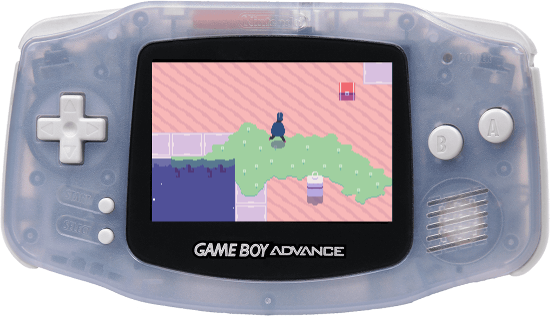

# Blind Jump Embedded

  

## Introduction

This repository contains a substantial re-write of the original BlindJump code. In the current iteration, the core parts of the code have no external dependencies, and target a [theoretically] platform-neutral hardware abstraction layer. Already, the embedded version of BlindJump runs on Gameboy Advance, and has partial support for Desktop OSs (via SFML). When porting the game to a new platform, one only needs to re-implement the Platform class in source/platform/.

## Building

The project should be pretty easy to compile, but if you have trouble, please try using the dockerfile before emailing me with OS environment questions.
