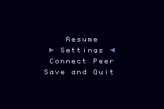

# Blind Jump (portable)

You should find this readme mosty up-to-date, but as the game is under active development, everything is subject to change, and sometimes edits to the readme lag significantly behind changes to the game itself.


## Contents
<!--ts-->
   * [Contents](#contents)
   * [Introduction](#introduction)
   * [Gameplay](#gameplay)
      * [Controls](#controls)
      * [Multiplayer](#multiplayer)
      * [Settings](#settings)
   * [Implementation](#implementation)
   * [Building](#building)
<!--te-->

## Introduction

Blind Jump is a simple action/adventure game. Evan Bowman started the project in late 2015 while in college, and resumed work on the code after a several year long hiatus, during which he was teaching himself oil painting. The game is designed to run on a wide variety of platforms, from macOS to the Nintendo Gameboy Advance.

The game uses procedural algorithms to generate the levels, so the level designs change each time you play. While the game is designed to be difficult, it will also be possible to beat the whole game in under an hour. At time of writing, the game has two bosses after each of the first ten levels, with twenty more levels currently in development. Enemies and environments change after each boss fight.

<p align="center">
  
</p>

<p align="center">
  
</p>

<p align="center">
  
</p>

<p align="center">
  
</p>

## Gameplay

### Controls

On the gameboy advance, use the d-pad to move, the A button to shoot, and the B button to interact with things and to select items and options in the game's menus. If you hold the B button while walking, you will shoot repeatedly, and also the player will strafe. 

Hold the right shoulder button, or the left shoulder button, to open up a quick item selector menu, or a minimap, respectively. 


To access all for your items, press select. Press start for more options.

### Multiplayer


The game supports multiplayer over the gameboy advance's serial port. While certainly incomplete, you should find the multiplayer mode to be more-or-less playable.
To enable, press the start button on both devices, and then select the "Connect Peer" option within twenty seconds. You need to be on the very first level to connect a peer, otherwise the option will be grayed-out. If running on an actual GAMBOY ADVANCE, you may need to select "Connect Peer" on the device plugged into the gray end of the link cable first, followed by the device connected to the smaller purple end of the link cable. This is a known issue, and I am still working on resolving this, at time of writing.

### Settings



By opening the start menu, and selecting "Settings," you may configure a number of options while the game is running. The difficulty setting can only be changed when no enemies remain on the current level.

When enabling "Show Stats," the game will print a number of metrics to the screen, such as framerate, link cable transmitted messages, link cable received messages, link transmit loss, and link receive loss.

The contrast option allows you to increase/decrease the game's contrast. Early gameboy advance games, prior to frontlit/backlit screens, were especially high contrast (perhaps due to the poor quality of the screen), and if you are playing on a device without a backlight or a frontlight (such as the original AGB model), you may want to increase the contrast a bit. If you are running the game on an emulator, and your monitor has poor grayscale reproducution, and the game's colors display with excessive contrast, you may want to decrease the contrast. Or if your computer monitor is washed out, maybe you would bump up the contrast. Anyway, many days of work went into the design of the game's color palette, so if you can see the game fine, without distraction, with the default setting, you should just leave the contrast as-is.

The settings screen also allows you to change the language, although the only language currently available is English. As the game is not yet complete, translations would be premature. But the game does support utf8 strings, so all you would need to do to add a new language, would be to define strings and a charset mapping in source/localization.cpp, and then add the character image file for your language. Most of the characters for Spanish and French should already be available in existing charset_en_spn_fr.png (note: if you are creating a charset, make sure that the first 8x8 tile includes one pixel in the top left corner, which matches the background color of the glyph image; this is how the game determines which color of the glyph is foreground, and which color is background).

## Implementation

This repository contains a substantial re-write of the original BlindJump code. In the current iteration, the core parts of the code have no external dependencies, and target a [theoretically] platform-neutral hardware abstraction layer. The embedded version of BlindJump runs on Gameboy Advance, and has partial support for Desktop OSs via SFML. When porting the game to a new platform, one only needs to re-implement the Platform class in source/platform/.

The game is written almost entirely in C++, with a small amount of C, as well as a teeny bit of ARM assembly.

## Building

The project should be pretty easy to compile, but if you have trouble, please try using the attached docker container before emailing me with operating system questions.
```
docker pull ubuntu:18.04
sudo docker build -t blind_jump_build .
sudo docker run -it blind_jump_build
make
```

NOTE: you can also get a containerized build environment from the link below, although you'll have to remember to run `git pull` when entering the container, because I built the container with a frozen version of the repository. If this is inconvenient for you, feel free to build the container yourself using the steps above.

https://hub.docker.com/r/evanbowman/blind_jump_build
