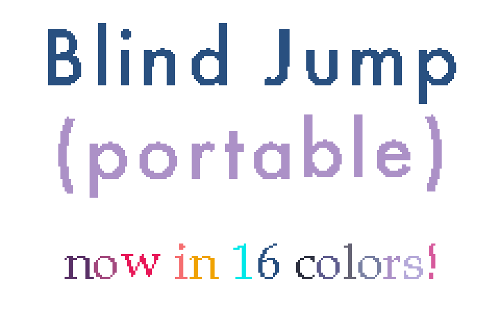
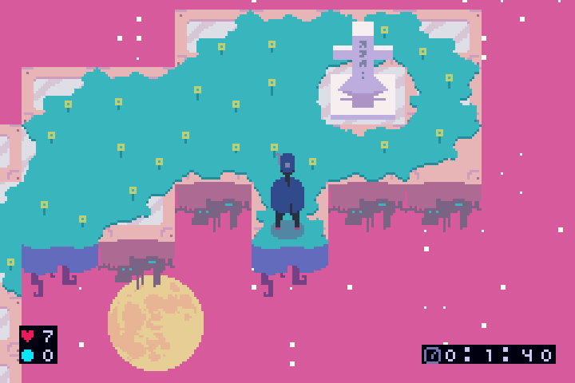
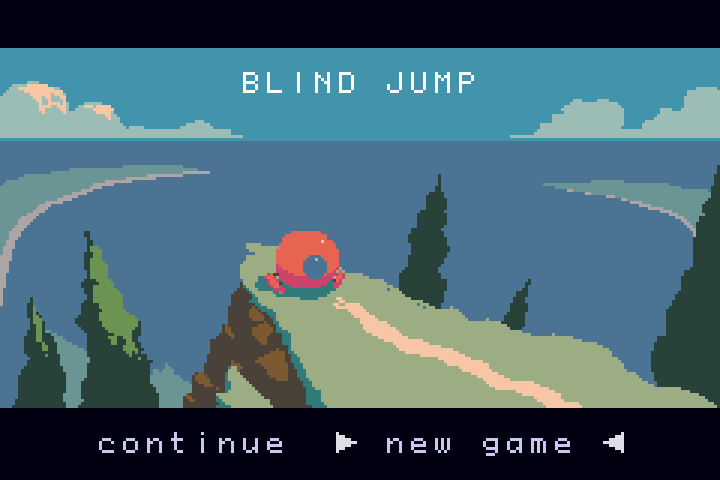
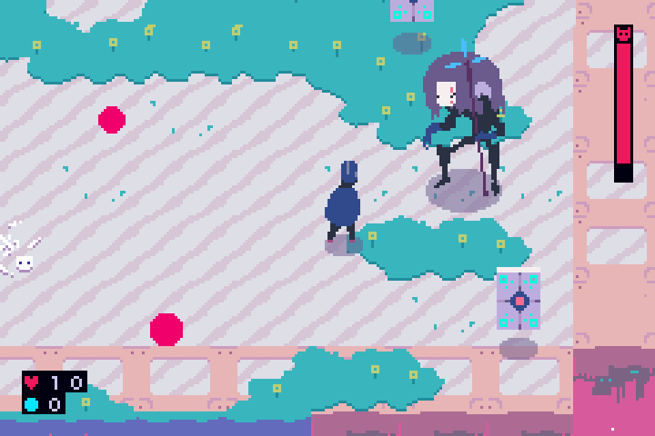
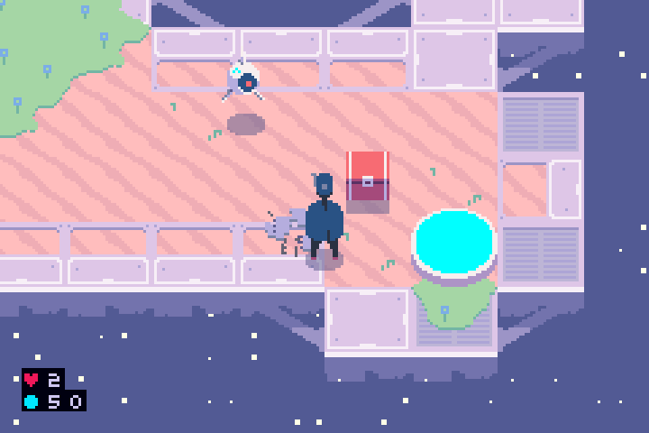
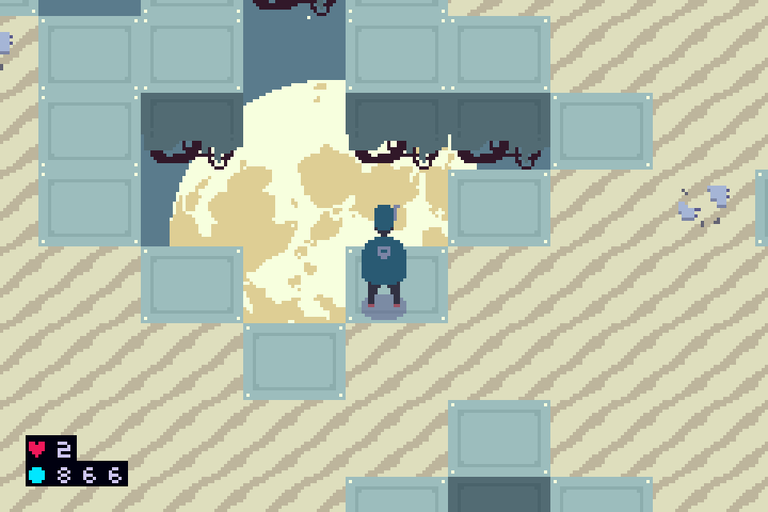
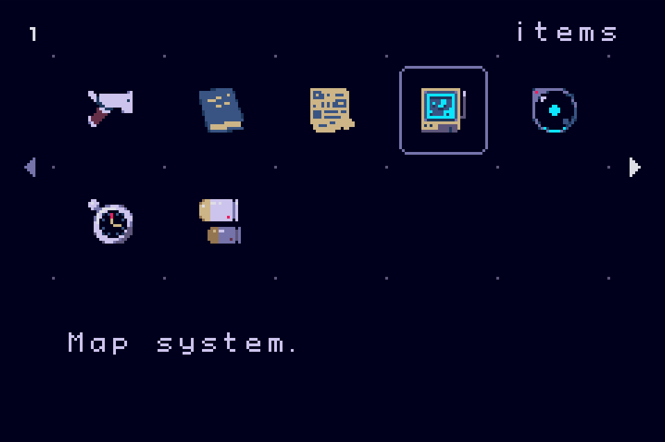
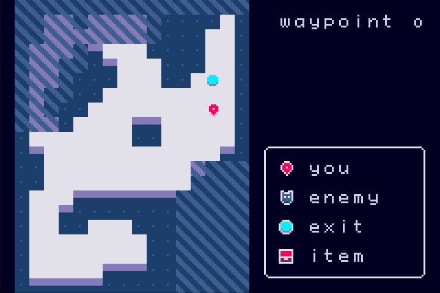
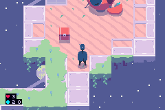
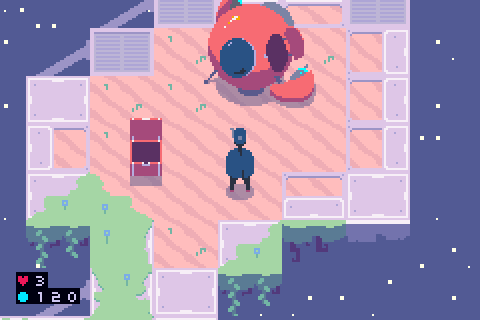

<a href="https://scan.coverity.com/projects/evanbowman-blind-jump-portable">
  
</a>  

<p align="center">
  
</p>

<p align="center">
  
</p>


# Blind Jump (portable)


You should find this readme mosty up-to-date, but as the game is under active development, everything is subject to change, and sometimes edits to the readme lag significantly behind changes to the game itself.

<b>Game Preview GIF</b>


## Contents
<!--ts-->
   * [Contents](#contents)
   * [Introduction](#introduction)
   * [Gameplay](#gameplay)
      * [Controls](#controls)
      * [Multiplayer](#multiplayer)
      * [Secrets](#secrets)
   * [Implementation](#implementation)
      * [Scripting](#scripting)
   * [Building](#building)
   * [Contributing](#contributing)
      * [Music](#music)
   * [Localization](#localization)
   * [Security](#security)
   * [Downloads](#downloads)
   * [Feedback](#feedback)
   * [Licence](#licence)
<!--te-->

## Introduction

<p align="center">
  
</p>

Blind Jump is a simple action/adventure game, featuring procedurally generated level maps, collectible items, fluid animation, and meticulously designed color palettes. Evan Bowman started the project in late 2015 while in college, and resumed work on the code after a several year long hiatus, during which he was teaching himself oil painting. Originally developed for macOS, the game was rebuilt from scratch during the 2020 pandemic, with a new custom engine. Blind Jump now compiles for various other platforms, including Linux, Windows, Nintendo Gameboy Advance, and Sony PlayStation Portable.

<p align="center">
  
</p>

<p align="center">
  
</p>

<p align="center">
  
</p>

<p align="center">
  
</p>

<p align="center">
  
</p>

[Contents↑](#contents)

## Gameplay

### Controls

On the the directional buttons or analog stick to move, the B/X button to shoot, and the A/O button to interact with things and to select items and options in the game's menus. If you hold the B button while walking, you will shoot repeatedly, and also the player will strafe. Tap A while walking to dodge.

Hold the right shoulder button, or the left shoulder button, to open up a quick item selector menu, or a minimap, respectively.

Some people prefer to have the strafe and shoot mapped to different keys. For an alternate button mapping, where A=strafe, B=shoot, and Left_Bumper=dodge, switch the strafe key setting to separate in the settings menu.




To access all for your items, press select. Press start for more options.

### Multiplayer


The GBA edition of the game supports multiplayer over the gameboy advance's serial port. While certainly incomplete, you should find the multiplayer mode to be more-or-less playable. The PSP edition does not support multiplayer at this time.
To enable, press the start button on both devices, and then select the "Connect Peer" option within twenty seconds. You need to be on the very first level to connect a peer, otherwise the option will be grayed-out. If running on an actual GAMBOY ADVANCE, you may need to select "Connect Peer" on the device plugged into the gray end of the link cable first, followed by the device connected to the smaller purple end of the link cable. This is a known issue, and I am still working on resolving this, at time of writing.

### Secrets

#### Boss Rush Mode

With the title screen open, press select fifteen times, and the game will enter a boss-rush mode. Note that entering boss-rush mode is equivalent to starting a new game, and you will lose any items that you may have collected.

Technically, you may also enter boss-rush mode at any time, by opening the script console (see below), and executing the command: `(set 'debug-mode 7)`. The next transporter will then take the player to a boss.

#### Script Console

Open the pause screen, and press the left bumper repeatedly, and a menu option for a script console will appear in the pause menu. This gives you access to the game's lisp interpreter, which allows you to manipulate certain variables, add items, jump to levels, etc. See [Scripting](#scripting) for more info about the lisp dialect. Press A to enter text, and B for backspace (B will also exit the console if the text entry is empty). Press start to enter a command, and press L to open a list of variable autocomplete options. If the completion list is open, you may press A to select a completion, or B to cancel out of the autocomplete. The intrepreter will highlight excessive closing parentheses in red, making it easier to keep track of parens for really long lines where you cannot see the beginning of the command.


#### UART Interface

In addition to providing an on-screen script console, the Blind Jump GBA edition also supports a scripting interface via UART. To connect your personal computer to the Gameboy Advance's serial port, you will need to splice an RS232 cable into a Gameboy Advance link cable, such that:
```
SO  --------> 5 RxD
SI  <-------- 4 TxD
GND <-------> 1 GND
```

Connect the two devices, set your PC's baud rate the standard 9600 Hz, and turn on the gameboy advance. If you've never used a UART console, try picocom, which is known to work.


[Contents↑](#contents)

## Implementation

This repository contains a substantial re-write of the original BlindJump code. In the current iteration, the core parts of the code have no external dependencies, and target a [theoretically] platform-neutral hardware abstraction layer. This embedded version of BlindJump runs on Gameboy Advance, PSP, and has partial support for Desktop OSs via SFML. When porting the game to a new platform, one only needs to re-implement the Platform class in source/platform/.

The game is written almost entirely in C++, along with a small amount of C, a custom dialect of LISP, as well as a teeny bit of ARM assembly.

### Scripting

BlindJump uses a custom LISP dialect for lightweight scripting. The init.lisp script offers some further usage tips, but generally, our LISP implementation supports functions as first class values, most of the common builtins, like map, cons, list, etc., variadic functions, and many more features. In the settings menu, the game allows you to launch a repl while the game is running, to manipulate game state (for gameboy builds, the game will render an onscreen keyboard and console, for desktop builds, the game will pause, and read from the command line).

#### Why not just use LUA/TCL/etc.

We actually considered LUA, but the LUA interpreter uses a lot of memory (relatively), and requires an implementaion of realloc. We did not want to add non-deterministic memory dependencies to the project. Blind Jump's lisp interpreter state, operand stack, and heap all fit within 11kB, and the interpreter allocates all values from fixed memory pools within the interpreter's ~11kB memory block. At startup, without any libraries or code loaded, the Lua vm uses more memory than Blind Jump's lisp interpreter when fully saturated (~800 live objects).

[Contents↑](#contents)

## Building

The project should be pretty easy to compile, but if you have trouble, please try using the attached docker container before emailing me with operating system questions.
```
docker pull ubuntu:18.04
sudo docker build -t blind_jump_build .
sudo docker run -it blind_jump_build
make
```

NOTE: you can also get a containerized build environment from the link below, although you'll have to remember to run `git pull` when entering the container, because I built the container with a frozen version of the repository. If this is inconvenient for you, feel free to build the container yourself using the steps above.

https://hub.docker.com/r/evanbowman/blind_jump_build

[Contents↑](#contents)

## Contributing

The best way to help this project along, would be to download and play the game. All suggestions for improvements are welcome.

### Music

Because adding new music to the GBA version of the game is tedious/complicated, we should take a moment to describe the methodology for formatting and compiling sound files. The Gameboy Advance hardware more-or-less requires digital audio data to be formatted as 8-bit signed wav files. To add new sound files to the project, the data will need to be converted to headerless 8-bit signed PCM, at 16kHz. Then, the data will need to be converted to an ASM file, and compiled into the project. Evan Bowman hacked together a tool for this, available here: https://github.com/evanbowman/raw_to_asm. The raw_to_asm tool should be run from the BlindJump project root. The music/sound file should be exported to the required raw format, with a .raw extension, and placed in the sounds/ directory. Then, you should run raw_to_asm, with the name of the sound file, minus the .raw extension (`raw_to_asm music`, where music.raw exists in sounds). The program will write header and source files containing an assembler representation of the music data to the source/data/ directory. You will need to add the new source file to CMakeLists.txt, and add some new declarations for the sound or music data to gba_platform.cpp. Also, remember that GBA cartridges should be no larger than 32mb

[Contents↑](#contents)

## Localization

The BlindJump text engine supports localized character sets via utf-8 encoding; however, the game does not include every possible utf-8 codepoint in its character map (see the charset image in images/). BlindJump currently supports alpha-numeric glyphs for English, a few hundred glyphs for Chinese words, some extended glyphs for Spanish and French, and a minimal Japanese Katakana charset (including accent marks). To add a new language to the game, you would need make a couple of changes:
1) Create a new file, <language_name>.txt, in the strings/ directory. For the sake of simplicity, you may want to just make a copy of one of the existing files in the strings/ folder.
2) Define a translation, by translating each string in the newly created file to the desired language. Make sure you test the translation thoroughly by actually playing the game, to verify that you are not accidentally using strings that are too long, which may cause graphical glitches. Remember that the Gameboy Advance can display 30 characters horizontally, so for any strings that the game's UI does not reflow onto the next line, your translated text may be either truncated, or in some cases, the game will write an error to the logs indicating that the program was unable to display the excessively long text, and halt execution (freeze).
3) Next, find the definition of the `languages` list variable in scripts/init.lisp, and add a symbol corresponding to the name of the newly added language file (minus the .txt extension, see init.lisp for examples).
4) Lastly, you will need to explicitly link your strings file to the build system in CMakeLists.txt. Because the Gameboy Advance version of the game does not run in hosted environments, there is no filesystem, so the build system needs to know about your file, in order to copy its contents into the ROM.

Currently, BlindJump includes an English edition (default) and a Chinese translation (contributed by verkkarscd).

Please note that displaying unicode text is a fairly complex operation for a Gameboy game, so the text engine for the GBA has a number of limitations:
1) The text formatting system will not display more than 80 unique glyphs at a time onscreen in most cases. For scenes with fullscreen text, the game can display a few hundred different glyphs at once (enough for fullscreen chinese text). For languages requiring double-sized text (16x16px rather than 8x8px, divide the number of allowed onscreen glyphs by four).
2) Each line in a localized strings data file can be no longer than 1987 bytes. Remember that each glyph in a utf-8 string may take up more than one byte! In practice, we have not had any issues with the text length limitation, because both English and Chinese are dense languages, in terms of how many words one must write to express an idea.


[Contents↑](#contents)

## Security

I periodically submit all of this project's source code to the Coverity static analyzer, which checks for buffer overruns, memory corruption, etc. Currently, BlindJump is 100% defect free. Let's keep it that way.

[Contents↑](#contents)

## Downloads

See the [releases section](https://github.com/evanbowman/blind-jump-portable/releases) of this github remote repo, where you may download the Gameboy Advance ROM directly (files with a .gba extension), and play the game with a flash cartridge (e.g. Everdrive). You could also use an emulator, although I personally prefer to play gameboy advance games on the actual device. You will find ROMs attached to each release, going all the way back to 2019, so you could also download earlier ROMs to see how the project changed as new code was introduced. If you want to play the Windows or the Linux version of the game, you will need to clone this repository and build the executable yourself, as we do not have an automated build pipeline yet for these platforms. You would not notices any major differences between the GBA and the Desktop versions of the game, except that the Desktop version of the game renders to a larger resolution render target, so the view scrolling will appear less choppy than if you were to play the GBA game in an emulator in fullscreen mode.

[Contents↑](#contents)

## Feedback

Have an opinion about the game, or suggestions for improvements? I encourage you to create an issue, or to leave a comment over [here](https://evanbowman.itch.io/blindjump).

[Contents↑](#contents)

## Licence

Most of the code in this project is available under the MIT licence. The Gameboy Advance and PlayStation Portable builds of the project reference code from external/libgba and glib2d (respectively), which are GPL projects. Consequently, the Gameboy Advance and PSP builds must be distributed under the terms of the GPL licence. The game is already open source, so this makes little difference, just worth mentioning, for people reading the code. As the Desktop builds of the project do not reference the gpl'd code in any way, the desktop builds are not GPL.

All of images and character designs belong to Evan Bowman, and should not be used for commercial purposes without permission. The music belongs to various composers. Most of the music tracks are Creative Commons and merely require attribution (see the game's ending credits), but a few of the music tracks may not allow distribution in a commercial context. These tracks would need to be replaced, if copies of the game were to be sold.
