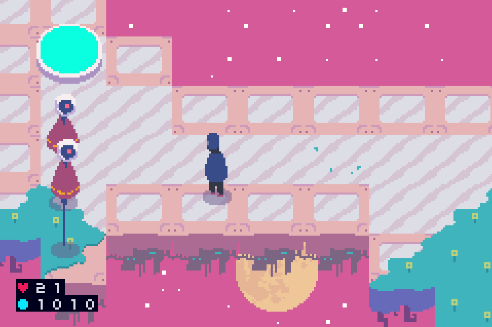

# Blind Jump Portable

## Contents
<!--ts-->
   * [Contents](#contents)
   * [Introduction](#introduction)
   * [Implementation](#implementation)
   * [Building](#building)
<!--te-->

## Introduction

Blind Jump is a simple action/adventure game. Evan Bowman started the project in late 2015 while in college, and resumed work on the code after a long hiatus, during which he was teaching himself traditional oil painting. The game is designed to run on a wide variety of platforms, from macOS to the Nintendo Gameboy Advance.

The game uses procedural algorithms to generate the levels, so the game changes each time you play. While the game is designed to be difficult, it will also be possible to beat the whole game in under an hour. At time of writing, the game has two bosses after each of the first ten levels, but I am planning on adding twenty more levels. Enemies and environments change after each boss fight.

<p align="center">
  
</p>

<p align="center">
  
</p>

<p align="center">
  
</p>

<p align="center">
  
</p>

## Implementation

This repository contains a substantial re-write of the original BlindJump code. In the current iteration, the core parts of the code have no external dependencies, and target a [theoretically] platform-neutral hardware abstraction layer. The embedded version of BlindJump runs on Gameboy Advance, and has partial support for Desktop OSs via SFML. When porting the game to a new platform, one only needs to re-implement the Platform class in source/platform/.

## Building

The project should be pretty easy to compile, but if you have trouble, please try using the attached docker container before emailing me with operating system questions.
```
docker pull ubuntu:18.04
sudo docker build -t blind_jump_build .
sudo docker run -it blind_jump_build
make
```

NOTE: you can also get a containerized build environment from the link below, although you'll have to remember to run `git pull` when entering the container, because I built the container with a frozen version of the repository. If this is inconvenient for you, feel free to build the container yourself using the steps above.

https://hub.docker.com/r/evanbowman/blind_jump_build
